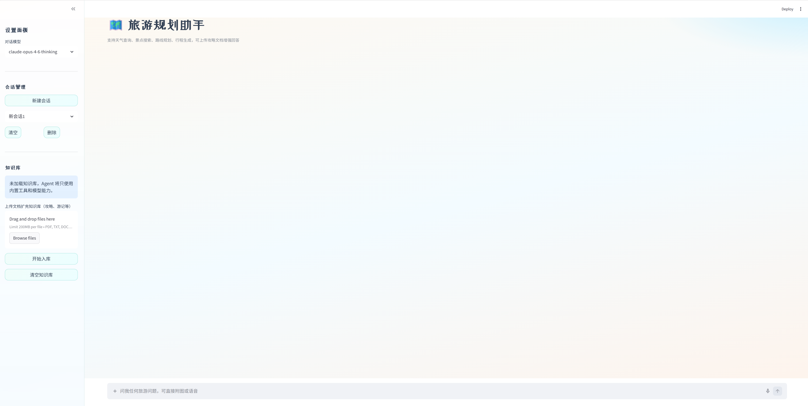

# Travel Assistant

一个基于 `Streamlit + LangGraph + LangChain + Chroma` 的中文旅游助手，支持旅游问答、行程规划、多模态输入与本地知识库检索（RAG）。

## 功能特性

- 多轮旅游对话（问天气、景点、美食、路线、距离等）
- 自动行程规划（按天拆分，结合偏好生成可执行方案）
- 图片景点识别（结合视觉模型与地图信息补充）
- 语音转文字（音频输入后提取并参与问答）
- 本地文档入库与 RAG 检索（支持旅游资料增强回答）
- 节点执行过程可视化（Router / Researcher / Planner）

## 工作流说明

本项目采用 LangGraph 多节点流程：

1. `Router`：识别用户意图（规划行程 / 问答 / 闲聊）并提取关键信息。
2. `Researcher`：调用地图工具、多模态工具和本地知识库（RAG）收集资料。
3. `Planner`：基于汇总资料生成最终答复或完整行程。

流程：`router -> researcher -> planner`。

## 项目结构

```text
AGENT_TOUR_copy/
├─ agents/              # Router / Researcher / Planner 工作流节点
├─ core/                # LLM、工具、知识库管理
├─ data/                # Chroma 持久化数据
├─ utils/               # 配置与环境变量
├─ main.py              # Streamlit 入口
├─ UI.py                # UI 组件与样式
├─ api_key.env          # 本地密钥配置（不要提交）
├─ requirements.txt     # 依赖列表
└─ README.md
```

## 运行环境

- Python 3.10 或 3.11

## 快速开始

1. 克隆项目并进入目录

```bash
git clone https://github.com/<你的用户名>/<你的仓库名>.git
cd AGENT_TOUR_copy
```

2. 创建并激活虚拟环境（推荐）

```bash
python -m venv .venv
```

Windows PowerShell：

```powershell
.\.venv\Scripts\Activate.ps1
```

macOS / Linux：

```bash
source .venv/bin/activate
```

3. 安装依赖

```bash
pip install -r requirements.txt
```

4. 在项目根目录创建 `api_key.env`

```env
AMAP_API_KEY=你的高德地图Key
ZHIPU_API_KEY=你的智谱Key
PROXY_API_KEY=你的代理或 Gemini Key
ALI_API_KEY=你的阿里百炼Key
```

环境变量说明：

| 变量名 | 用途 |
| --- | --- |
| `AMAP_API_KEY` | 天气、景点、美食、路线查询 |
| `ZHIPU_API_KEY` | GLM 模型与 embedding |
| `PROXY_API_KEY` | Gemini / 代理模型 |
| `ALI_API_KEY` | Qwen 多模态与音频能力 |

5. 启动项目

```bash
streamlit run main.py
```

启动后浏览器会自动打开本地页面。

## 使用说明

1. 在侧边栏选择模型，输入你的旅游问题或规划需求。
2. 需要行程时，请尽量提供城市、天数、偏好（如美食/人文/亲子）。
3. 上传文档后可进行知识库问答，系统会自动切分并写入向量库。
4. 上传图片可识别景点信息；上传音频可转写后参与问答。

## 支持的知识库文件

- `pdf`
- `txt`
- `docx`
- `csv`

向量库默认持久化路径：`data/chroma_db/`。

## 近期优化

- 修正路由节点模型选择，真正使用轻量模型做意图识别
- 为 LLM 实例增加缓存，减少重复初始化开销
- 复用文档切分器，提升批量入库时的稳定性和速度
- 自动清理图片/音频临时文件，减少磁盘残留和句柄占用


